# An-Introduction-to-natural-language-processing
The materials in this repository are my personal notes from Professor Massimo Piccardi's Natural Language Processing course, 32931 TRM, at the University of Technology Sydney (UTS).

# Table of Contents

1. [What is Natural Language Processing (NLP)?](#what-is-natural-language-processing-nlp)
2. [An Overview of NLP Tasks](#an-overview-of-nlp-tasks)
3. [Document Vectors](#document-vectors)
4. [Word Embeddings](#word-embeddings)
5. [An Example of Two Major Tasks:](#an-example-of-two-major-tasks)
    - [Named-entity Recognition](#named-entity-recognition)
    - [Topic Modelling](#topic-modelling)
6. [Concluding Remarks](#concluding-remarks)

# What is Natural Language Processing (NLP)?
Natural language processing (NLP) lies at the intersection of linguistics and machine learning, focusing on the analysis and generation of human language.
This field has witnessed a rapid growth in interest and has become a dominant area within artificial intelligence.
NLP is applied across various sectors, including but not limited to social media, e-commerce, healthcare, educational technology, financial services, and the entertainment industry.

Historically, NLP methodologies were grounded in ***linguistic theory***, encompassing syntax, vocabulary, morphology, and meaning. However, as the field has evolved, ***statistical methods*** and data-driven ***machine learning*** have taken precedence.


## A historical overview

In the 1950s, the field of NLP emerged with the Turing Test and initial machine translation efforts, setting the stage for computational linguistics. The 1960s solidified this foundation with pivotal algorithms and ELIZA, the first chatbot, signaling the potential for machine understanding of language. The subsequent decade saw a shift towards rule-based systems like SHRDLU, which encoded linguistic rules but struggled with the complexity and variability of natural language.

The 1980s marked a turning point with the adoption of statistical methods, employing mathematical models to grapple with linguistic ambiguities, a significant move away from rigid rule-based systems. This statistical revolution blossomed in the 1990s as burgeoning text corpora became fodder for machine learning, enhancing the precision of NLP applications and giving rise to algorithms suited for a range of linguistic tasks.

Entering the 2000s, these advancements propelled speech recognition forward, leading to its integration into everyday technology and improving human-computer interaction. The next major leap occurred in the 2010s with the advent of deep learning and neural networks, which underpinned the development of sophisticated models capable of learning directly from vast amounts of data, minimizing the need for manual feature engineering.

Today, the 2020s are defined by transformer-based models and large language models like GPT-3, which have dramatically extended the capabilities of NLP. These models, leveraging self-attention mechanisms, have not only set new benchmarks in language generation and translation but have also expanded AI's reach into creative domains previously thought exclusive to human ingenuity.

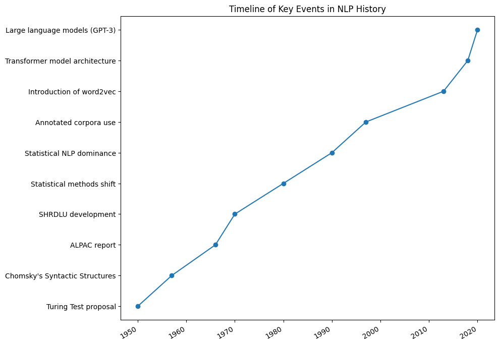

### Contemporary NLP: key enablers
Three primary catalysts have propelled the swift expansion of NLP:
1. Enhanced ***algorithms*** that achieve practical accuracy levels in real-world applications.
2. Upgraded ***computational and networking infrastructures***, including GPUs, TPUs, FPGAs, and extensive cloud and edge computing resources. 
3. The abundance of ***textual data***, which is now widely available in digital format from a diverse array of sources.

### NLP: a profusion of data
The scope of NLP data is broad, drawing from a multitude of sources such as an organization's proprietary documents, established publications, and a variety of web pages. It also includes data from product inventories and customer evaluations, online social discourse and blog entries, as well as journalistic content and broadcast transcriptions. Furthermore, this data is not limited to one language, often encompassing numerous tongues and their automatic translations. Additionally, spoken language data is captured through speech-to-text technologies like those in virtual assistants such as Siri, Alexa, and Cortana.

### ChatGPT
When ChatGPT debuted last November 2022, it quickly became a global phenomenon. It's important to acknowledge the unparalleled and astounding range of tasks it can perform. Its appeal lies in its adaptability, enabled through clever prompting. Yet, it isn't necessarily a substitute for other deep learning models that might be more efficient or superior in performance for certain tasks. Details on this will follow.

## An Overview of NLP Tasks
NLP encompasses a wide array of specialised tasks, typically grouped into:
- "Low-level" tasks, which are closely related to lexicon and syntax.
- "High-level" tasks, which deal more with semantics and meaning.

### Some popular NLP tasks
Some widely recognized NLP tasks are:
- Named-entity recognition
- Sentiment analysis
- Topic modelling
- Summarisation
- Machine translation
- Dialogue systems

Note: There are numerous additional tasks, such as entailment recognition, relationship extraction, coreference resolution, wikification, …

#### Named-entity recognition
Named-entity recognition (NER) seeks to pinpoint and extract "named entities" from text, covering entities like person names, places, organizations, and various other specific categories. It's beneficial for categorizing text, detecting intent, identifying relationships, and building knowledge graphs.


REX (Rosette Entity Extractor, BASIS Technology)

#### Sentiment analysis
Sentiment analysis is designed to determine the emotional tone behind a text, which could be anything from a tweet to an email:

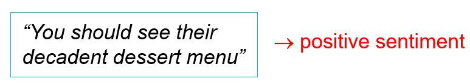

- At its most basic, it involves identifying particular keywords that indicate sentiment.
- In a more advanced method, the entire text is transformed into a vector (known as "document representation"), which a classifier then uses to deduce the sentiment's category.

#### Topic modelling
Topic modelling identifies the primary **topics** across a collection of documents, offering a snapshot of their collective content. Additionally, it ascertains **the proportion of these topics** within each document. 
These topic proportions can be used to automatically categorise, classify, or cluster each document, aiding in the organisation of the collection.

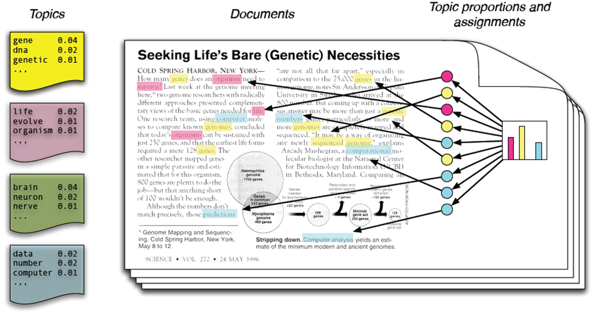

#### Summarisation
Abstractive summarization creates entirely new content. Below is an illustration of extractive text summarisation provided by Salesforce.

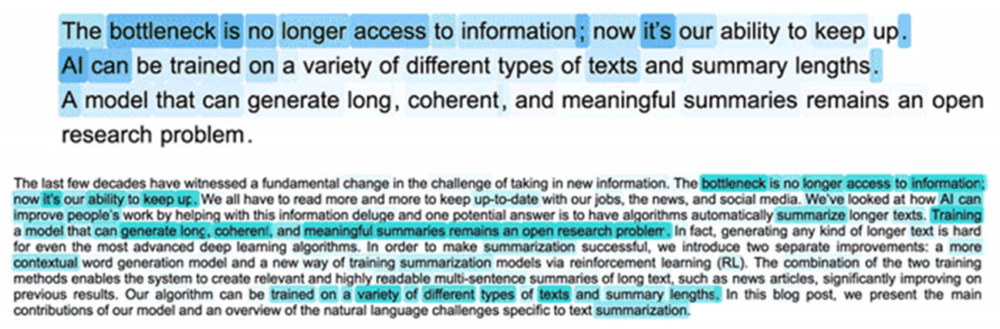
(courtesy of Frase.io)

#### Machine translation
Machine translation stands as one of the most effective uses of NLP. Given the multitude of language combinations, an intermediary language is sometimes employed (for instance, Filipino to English, then English to Catalan). Google Translate now has the capability to interpret between 109 languages by crawling the web and learning from content that appears to be translated versions of other pages.

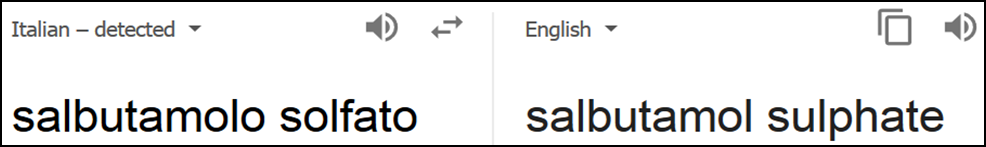

#### Dialogue systems
Dialogue systems represent perhaps the most sophisticated NLP technology emerging today. Key types include:
- **Task-oriented dialogue systems**: These engage in concise, focused dialogues to gather additional details from a user necessary to fulfill a task.
- **Question-answering systems**: These handle queries such as "Who was the monarch of Spain in 1492?" or "What is the result of multiplying two by 3.5?"
- **Chatbots**: These are designed for prolonged, interactive conversations that mimic human interaction.

User and customer engagement is enhanced through tools like Los Angeles Chip, which, as described by Los Angeles CIO Ted Ross, serves as a round-the-clock, accessible guide on conducting business with the city.


Additionally, Florence functions as a health monitoring and medication reminder system.


# Document vectors
A document vector is a numerical representation of an entire document, serving multiple purposes. With a vocabulary consisting of 'V' words, a simple document vector can be created by tallying the frequency of each vocabulary word's occurrence within the document:


### tf-idf

The mathematical formulas for term frequency (tf) and inverse document frequency (idf), which are used together in the tf-idf weighting scheme, are as follows:

1. **Term Frequency (tf)**: 
The term frequency \( tf(t, d) \) of a term \( t \) in a document \( d \) is defined as the number of times that term \( t \) occurs in document \( d \), sometimes normalized by dividing by the total number of terms in the document:

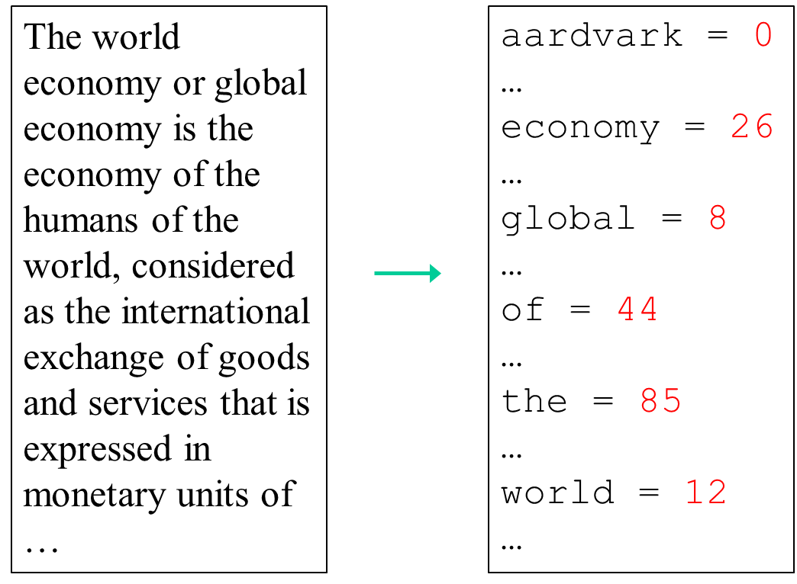

$$
tf(t, d) = \frac{\text{Number of times term } t \text{ appears in document } d}{\text{Total number of terms in document } d}
$$


Sometimes, the term frequency is not normalized, especially when we are interested in the raw frequency.

2. **Inverse Document Frequency (idf)**:
The inverse document frequency measures how much information the word provides, that is, whether the term is common or rare across all documents. It is calculated as the logarithm of the number of documents divided by the number of documents that contain the term \( t \). Plus one is often added to the denominator to avoid division by zero and then take the log:

$$
idf(t, D) = \log \left( \frac{N}{1 + |\{d \in D : t \in d\}|} \right)
$$

Where:
- ( N \) is the total number of documents in the corpus \( D \)
- \( |\{d \in D : t \in d\}| \) is the number of documents where the term \( t \) appears (i.e., \( tf(t, d) \neq 0 \))

When you combine these two metrics, you get the tf-idf score for a term in a document, which is simply the product of tf and idf:

$$
tfidf(t, d, D) = tf(t, d) \times idf(t, D)
$$

This score is often used in information retrieval and text mining as a weighting factor in searches of information repositories, text summarization, and user modeling. The tf-idf weight increases proportionally to the number of times a word appears in the document and is offset by the number of documents in the corpus that contain the word, which helps to adjust for the fact that some words appear more frequently in general.

**Illustrative Example**
Consider Shakespeare's corpus: the word "the" is extremely frequent, found 28,944 times. However, its ubiquity across all plays nullifies its idf, rendering it insignificant in tf-idf analysis.

Conversely, character names such as 'petruchio' in "THE TAMING OF THE SHREW" or 'macbeth' in "MACBETH" have high tf-idf scores, distinguishing them as key terms within their respective plays.

Here is a bar graph illustrating the tf-idf values for different terms. In this visualization, the term "the" has a tf-idf value of 0, reflecting its lack of importance due to its high frequency across all documents. The other terms, which are names of characters from Shakespeare's plays, have higher tf-idf values, indicating their significance and rarity across the corpus. The height of each bar represents the tf-idf score, demonstrating how the metric helps in identifying key terms within the text

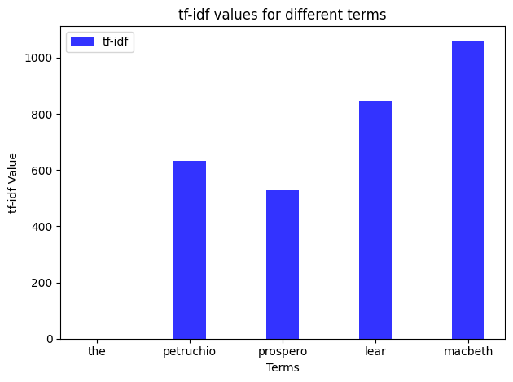

[Access the code](./src/tf-idf.ipynb)

**Applying the concept**
Given a book with pizza recipes in a collection of cooking books, what would be plausible tf and idf values for the following words? (Pick A or B)

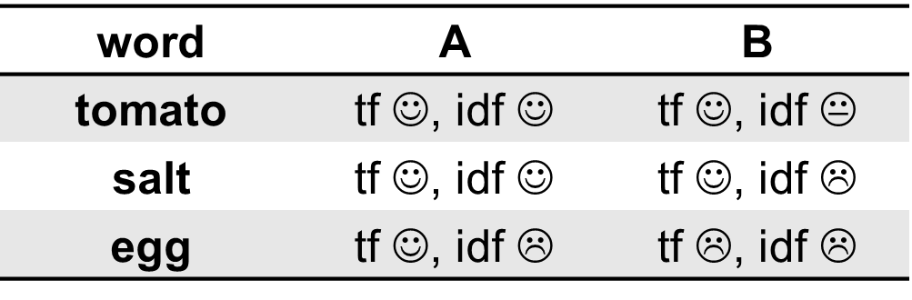

Here is the bar graph showing the term frequency (tf), inverse document frequency (idf), and tf-idf scores for the terms 'eggs', 'tomatoes', and 'salt' from the pizza cookbook document. 

This visualization shows 'salt' as the most prominent ingredient in the pizza cookbook, with 'tomatoes' also being a significant but slightly less prominent ingredient. The tf-idf score for 'salt' remains the highest, indicating its importance in the context of the pizza cookbook, followed by 'tomatoes' and 'eggs'.
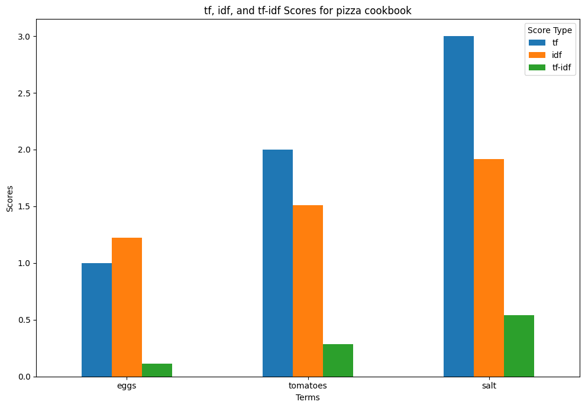
[Access the code](./src/img/tf-idf-cook.ipynb)

**Document classification with tf-idf**

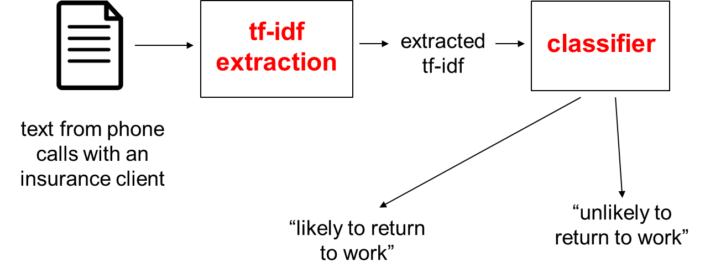

A classifier is an algorithm that takes in input a vector representation of an object, and outputs its "class".

# Word embedding

**Embeddings are the bridge** between human linguistic competence and the computational numeric processing. **Humans excel in understanding words**, while **computers excel in processing numbers**. Embeddings are where these two worlds converge, transforming words into numerical values.


The process of transforming words into vectors is commonly known as word embedding. This technique assigns each word to a position in a generally large-dimensional vector space. The underlying premise of this mapping is that **words with similar meanings will be positioned near one another** within this vector space.

The more refined these embeddings are, the more capable the language model becomes, as it simplifies complex linguistic problems into numerical ones.

**illustrative embedding scenario**
 We have a 2D plane where each word is assigned a pair of numerical coordinates. Imagine a word like 'orange' positioned at coordinates (1,2) — this signifies that in our embedding space, the word 'orange' is mapped to these specific numeric values. Now, suppose we're tasked with placing the word 'cherry' in this space. Where should it go? If we're organizing words by similarity, we might place 'cheery' near 'orange' since both are fruits.


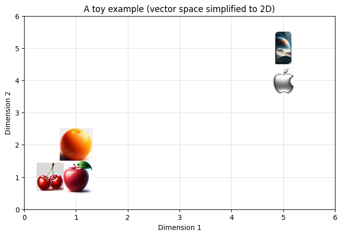

| Word          | Numbers (x,y)|
|---------------|--------------|
| Apple         | (1, 1)       |
| Orange        | (1, 2)       |
| Cherry        | (0.5, 1)     |
| Mobile Phone  | (5, 5)       |
| Apple Logo    | (5, 4)       |


Embeddings are not just about mapping words to pairs of numbers, though. In practice, words are represented by vectors composed of many numbers, sometimes in the thousands, capturing a vast array of linguistic properties and relationships. These vectors can even represent entire sentences or longer text segments. The columns in these vectors can capture specific attributes of words, like size or color, as well as more abstract features detected by the model.

Here's an example of what word embeddings might look like for the given words, using a hypothetical 5-dimensional space for simplicity:
| Word          | Dimension 1 | Dimension 2 | Dimension 3 | Dimension 4 |
|---------------|-------------|-------------|-------------|-------------|
| Apple (fruit) | 0.32        | -1.22       | 0.45        | 0.65        | 
| Orange        | 0.28        | -1.25       | 0.48        | 0.60        | 
| Cherry        | 0.30        | -1.20       | 0.47        | 0.63        | 
| Mobile Phone  | -0.50       | 1.05        | -0.75       | -1.22       |
| Apple Logo    | -0.48       | 1.10        | -0.77       | -1.20       | 


These numbers are entirely illustrative and don't represent real embeddings from any specific model. In practice, word embeddings are learned from data using algorithms like **GloVe** developed by Stanford, **Word2vec** by Google, and **fastText** by Facebook, and they usually have much more than five dimensions, often in the hundreds, as mentioned. The higher dimensionality allows for capturing a richer context and subtler semantic relationships between words. These methods primarily rely on examining the frequencies of words that are contextually adjacent to a target word, a concept originally proposed by John Rupert Firth in 1957.


## Named-entity recognition (NER)

Named Entity Recognition (NER) is a process in machine learning and natural language processing where the goal is to identify and classify key information (entities) in text into predefined categories. Examples of these categories include the names of persons, organizations, locations, expressions of times, quantities, monetary values, percentages, etc.

Here's a high-level overview of how modern NER systems work:

1. **Preprocessing**: The text is cleaned and preprocessed. This might involve removing unnecessary whitespace, converting to lowercase (except for potential named entities which often start with a capital letter), and sometimes lemmatizing the words (reducing them to their base or dictionary form).

2. **Word Embeddings**: Each word in the text is converted into a numeric form known as a word embedding. These embeddings capture semantic meaning and context within a high-dimensional space. For example, words that are used in similar contexts will have similar embeddings.

3. **Contextual Features**: In addition to word embeddings, modern NER systems might use additional features that capture the context around a word. This can include the part of speech of a word, its position in a sentence, or the embedding vectors of neighboring words.

4. **Classification**: The word, now represented as a vector (or set of vectors), is passed through a classification algorithm. This classifier has been trained on a labeled dataset where the entities are already marked and categorized. It uses the feature vectors to predict what category, if any, the word belongs to.

5. **Post-processing**: The output of the classifier is then post-processed to ensure consistency and to aggregate multi-word entities. For example, "New York" consists of two words that should be recognized as a single location entity.

#### Example

- **Input Sentence**: "Elon Musk founded SpaceX in Los Angeles in 2002."

- **Preprocessing**: The sentence is tokenized into words, and potentially unnecessary characters are removed.
  
- **Word Embeddings**: Each word is converted into an embedding vector.
  
- **Contextual Features**: The system might note that "Elon" is at the beginning of a sentence and is followed by "Musk," which could indicate a person's name.

- **Classification**: A classifier processes the features for each word and predicts:
  
  - "Elon Musk" as a Person
  - "SpaceX" as an Organization
  - "Los Angeles" as a Location
  - "2002" as a Date

- **Post-processing**: "Elon" and "Musk" are combined into a single entity "Elon Musk" tagged as a Person.

Contemporary approaches to NER are all based on **deep recurrent neural networks**, including Long Short-Term Memory (LSTM) networks and **Transformers**. These systems are generally trained end-to-end, starting with the input words as string sequences and culminating in the classification of entities. However, initializing these models with high-quality word embeddings can significantly enhance their overall effectiveness. For insights into the latest performance benchmarks in this area, consider examining the leaderboards at established NER competition sites.
http://nlpprogress.com/english/named_entity_recognition.html


# Topic modelling 
Equipped with a representation of the documents, we can revisit the concept of topic modeling under the following assumptions:

- We possess a large collection of documents, potentially exceeding a million.
- The term frequency (tf) or term frequency-inverse document frequency (tf-idf) metrics for each document have been determined.
- Given \( D \) documents and a vocabulary consisting of \( V \) terms, these metrics constitute a substantial \( V \times D \) matrix, known as the term-document matrix.

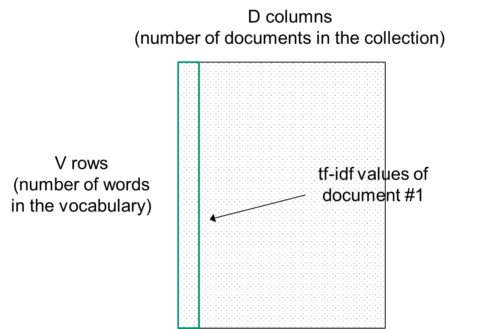

**Problem**
- Q1. Can we discern a subset of \( T \) **shared topics** within the collection of documents, where \( T \) is significantly smaller than \( D \)?
- Q2. Can we ascertain the degree to which each document is associated with each of these topics?


Let 's dive in Q1. Can we discern a subset of \( T \) **shared topics** within the collection of documents, where \( T \) is significantly smaller than \( D \)?
A topic is essentially a distinct distribution of word frequencies across the vocabulary. 
For example, within the "cricket" topic, terms like "stumps," "wicket," and "lbw" are likely to be prevalent, while their presence in other topics would be minimal. 
It's important to note that the relationship between words and topics isn't straightforward, as words like "bye," "bat," "bail," and "over" might appear frequently across various topics.

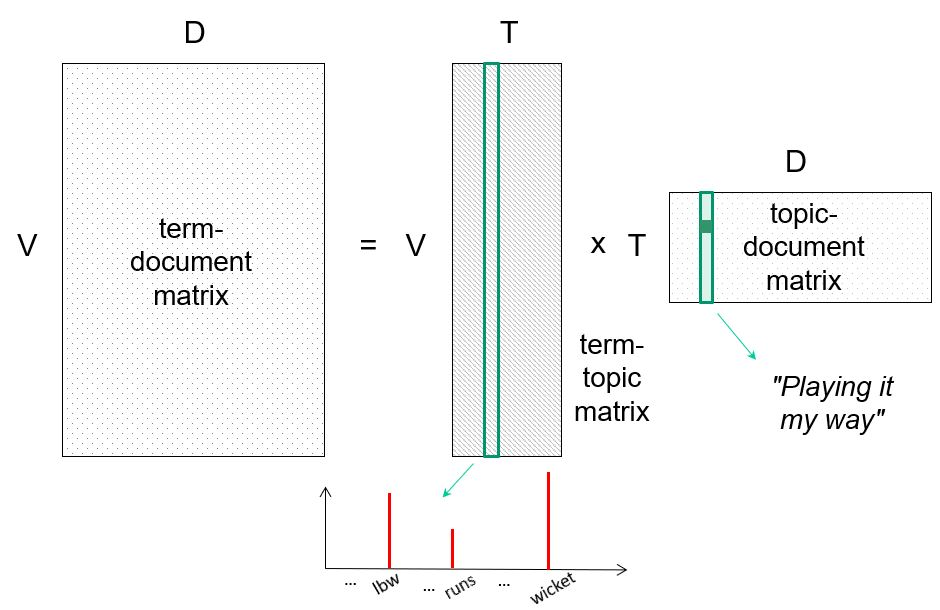

Topic modelling as matrix factorisation

#### Topic modelling: a schematic
For a set of documents, deconstruct them into matrices of **term-topic** and **topic-document**. 
The term-topic matrix provides insight into the overall collection of documents. 
Each vector within the topic-document matrix reflects the content of an individual document and can serve as a feature vector for document classification purposes.

**Example: classification based on topics**
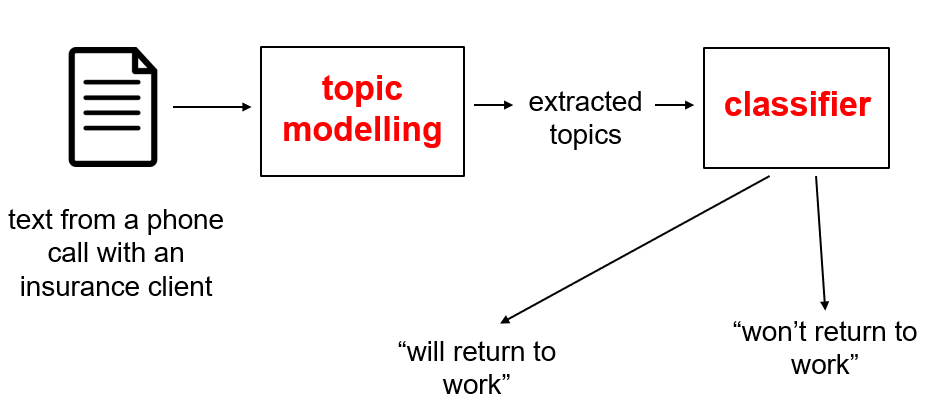

#### Latent Dirichlet allocation (LDA) 
Latent Dirichlet Allocation (LDA) stands as one of the most utilised topic modeling techniques, incorporating a probabilistic approach to the parameters of distributions that offers several benefits. This model is accessible in various libraries such as R, scikit-learn, and Gensim. For example, in scikit-learn:

```python
from sklearn.decomposition import LatentDirichletAllocation
...
lda = LatentDirichletAllocation(n_components=...)
lda.fit(...)
```

The selection of the number of topics, denoted by \( T \), is usually determined through heuristic methods.

**Example: classification based on topic vectors**

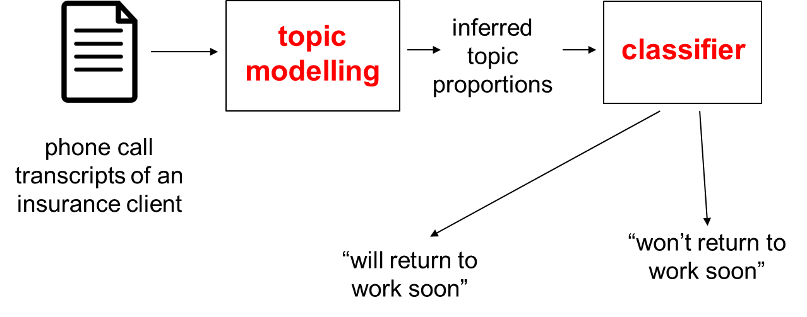

# How to become an NLP developer?

- Learn fundamentals of NLP and machine learning
- Learn Python, including NumPy, scikit-learn and pandas
- Learn traditional NLP libraries such as NLTK and Gensim
- Step up to a deep learning environment: PyTorch/Lightning, TensorFlow/Keras
- Learn all the tools of this trade, including AWS etc

# Summary
NLP is one of the most prominent components of the current AI “revolution” , handling a vast range of tasks from simple text tagging to chatbots. It is increasingly leveraging machine learning techniques and tapping into the vast pool of digital text data, making it integral to numerous applications across a variety of fields.

# Reference 

1. **Turing Test proposal (1950):**
   - Turing, A. M. (1950). Computing machinery and intelligence. Mind, 59(236), 433-460.

2. **Chomsky's Syntactic Structures (1957):**
   - Chomsky, N. (1957). Syntactic Structures. The Hague/Paris: Mouton.

3. **ALPAC report (1966):**
   - Pierce, J. R., et al. (1966). Languages and Machines: Computers in Translation and Linguistics. A report by the Automatic Language Processing Advisory Committee (ALPAC), Division of Behavioral Sciences, National Academy of Sciences, National Research Council.

4. **SHRDLU development (1970):**
   - Winograd, T. (1972). Understanding natural language. Cognitive psychology, 3(1), 1-191.

5. **Statistical methods shift (1980s):**
   - The shift to statistical methods was gradual and involved the work of many researchers. A specific reference is hard to attribute to this general trend.

6. **Statistical NLP dominance (1990s):**
   - Manning, C. D., & Schütze, H. (1999). Foundations of Statistical Natural Language Processing. MIT press.

7. **Annotated corpora use (Late 1990s):**
   - Marcus, M. P., Marcinkiewicz, M. A., & Santorini, B. (1993). Building a large annotated corpus of English: The Penn Treebank. Computational linguistics, 19(2), 313-330.

8. **Introduction of word2vec (2013):**
   - Mikolov, T., Chen, K., Corrado, G., & Dean, J. (2013). Efficient estimation of word representations in vector space. arXiv preprint arXiv:1301.3781.

9. **Transformer model architecture (2018):**
   - Vaswani, A., et al. (2017). Attention is all you need. Advances in neural information processing systems, 30.

10. **Large language models (GPT-3, 2020):**
    - Brown, T., et al. (2020). Language models are few-shot learners. Advances in neural information processing systems, 33, 1877-1901.

11. **Shakespeare’s plays**
    - http://www.opensourceshakespeare.org/stats/
12. **tf-idf**
    - http://www.philadelphia-reflections.com/blog/2792

13. Chris Manning, CS224n Natural Language Processing with Deep Learning, Stanford University
   -  possibly THE NLP online course
14. S. Bird, E. Klein, and E. Loper, Natural Language Toolkit https://www.nltk.org/index.html, http://www.nltk.org/book/
   - a famous library for building NLP programs in Python
15. D. Jurafsky, J. Martin, Dialog Systems and Chatbots, Speech and Language Processing, third edition draft, 2017
16. Various authors, Google's Neural Machine Translation System: Bridging the Gap between Human and Machine Translation, arXiv, 2016
17. V. Yadav, S. Bethard, A Survey on Recent Advances in Named Entity Recognition from Deep Learning Models, COLING 2018: 2145-2158
18. D. M. Blei, A. Y. Ng, M. I. Jordan, Latent Dirichlet Allocation, JMLR 2003

